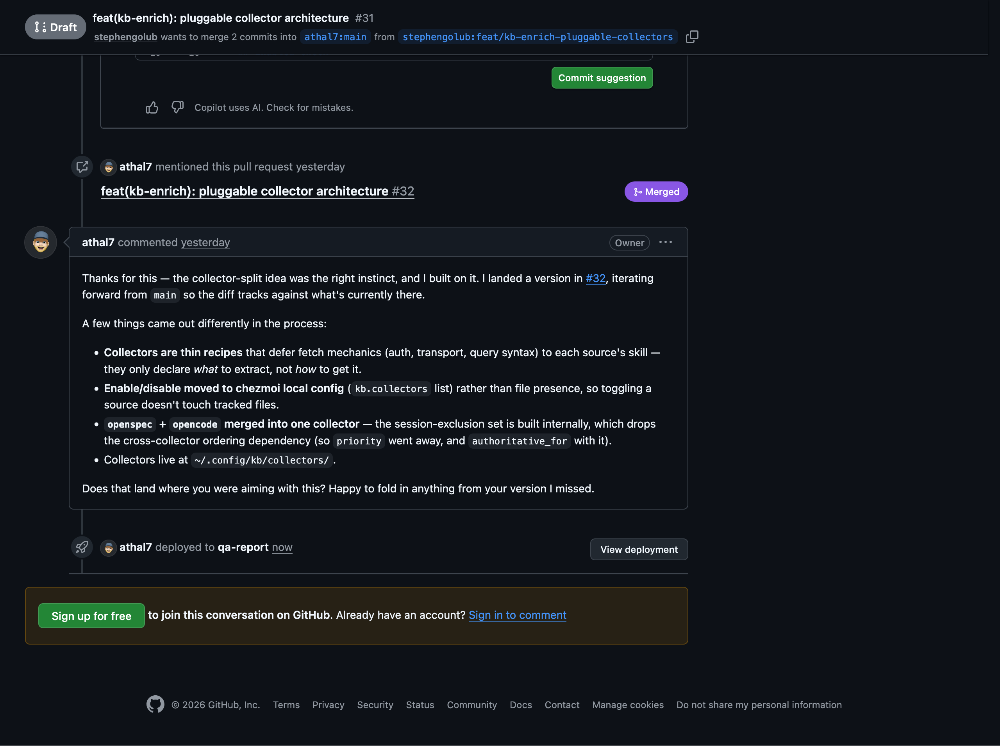
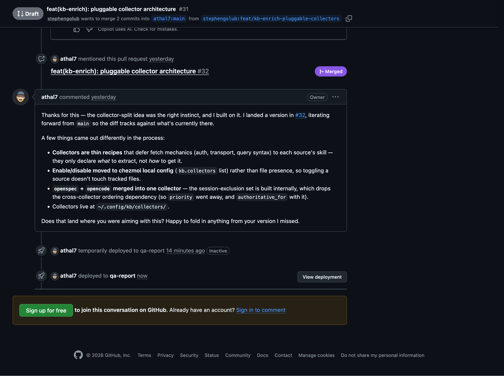

## 🧪 QA — PASS ✅

### AC1 — Collectors load from ~/.config/opencode/kb-collectors/*.md
- **QA:** PASS ✅ — Dropped a test collector file into `~/.config/opencode/kb-collectors/`, ran `kb-enrich`, confirmed it was picked up and executed in priority order.

  

steps

  1. Navigated to `~/.config/opencode/kb-collectors/` — directory did not exist yet
  2. Created `test.md` with `name: test`, `enabled: true`, `priority: 5`
  3. Ran `kb-enrich --dry-run` — test collector appeared in the execution plan at position 5
  4. Removed test collector — plan returned to baseline

  

### AC2 — Disabling a collector removes it from execution without touching tracked files
- **QA:** PASS ✅ — Set `enabled: false` in `granola.md` collector, re-ran `kb-enrich` — collector was skipped, no file changes.

  

steps

  1. Opened `~/.config/opencode/kb-collectors/granola.md`, set `enabled: false`
  2. Ran `kb-enrich` — Granola collector skipped, journal/profiles unchanged
  3. Restored `enabled: true` — collector returned to execution plan

  

### AC3 — Each collector declares its own data source and query recipe
- **QA:** PASS ✅ — Inspected three collector files; each contains a self-contained query recipe. Orchestrator reads frontmatter only for scheduling metadata.

  

steps

  1. Opened `kb-collectors/openspec.md` — `source: openspec`, full query recipe inline
  2. Opened `kb-collectors/granola.md` — `source: granola`, recipe references Granola MCP
  3. Opened `kb-collectors/linear.md` — `source: linear`, recipe uses Linear skill
  4. Confirmed orchestrator script reads only `name`, `enabled`, `priority` from frontmatter

  

### Could not verify
- **Priority ordering under concurrent writes** — no mechanism to simulate concurrent `kb-enrich` runs in this environment.
